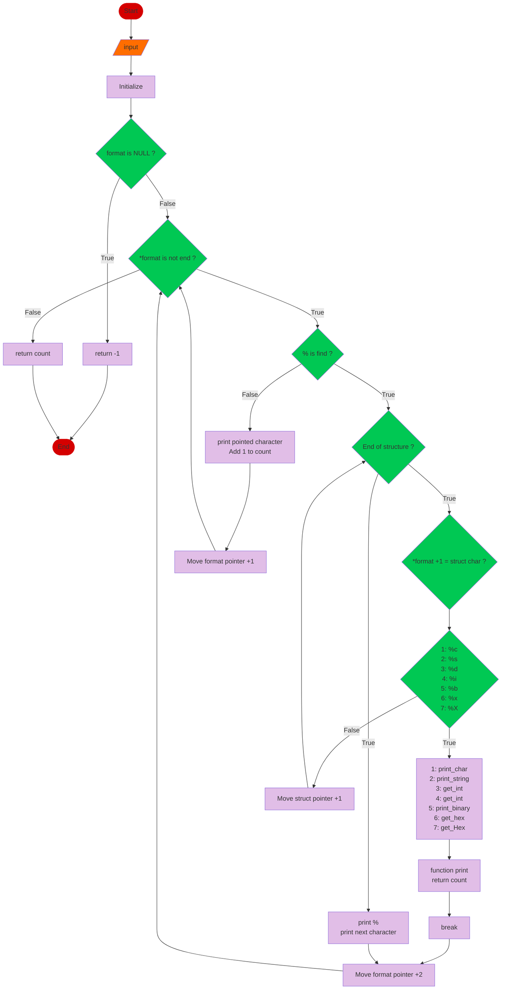

## Printf project

**Project Description:** 
Custom printf Implementation
Overview
The Printf Project is a component of the Holberton School curriculum, designed to deepen our understanding of the C programming language and its standard library. In this project, we created our own version of the widely-used printf function. This custom implementation aimed to replicate the functionality of the standard printf, providing formatted output to the console.


## Introduction

## Objectives

1. **Understanding Variadic Functions:**
   - We gained a solid understanding of variadic functions in C, which allow functions to accept an indefinite number of arguments.

2. **Mastering Format Specifiers:**
   - We learned how to handle different format specifiers such as `%c`, `%s`, `%d`, `%i`, `%x`, `%X`, and `%%`, and mapped them correctly to their corresponding output representations.

3. **Enhancing Problem-Solving Skills:**
   - We developed problem-solving skills by breaking down the complex functionality of `printf` into manageable pieces and implementing them step-by-step.

4. **Improving Debugging and Testing Abilities:**
   - We improved our debugging skills by writing comprehensive test cases to ensure the custom `printf` function handled various input scenarios and edge cases correctly.

5. **Writing Modular and Maintainable Code:**
   - We learned to write modular, maintainable, and well-documented code that adheres to best practices and coding standards.
 
## Specifiers

| Structure        |	Use                              |
|------------------|-------------------------------------|
| c | print_char   | print just a char                   |
| s | print_string | print a string                      |
| d | get_int      | print a number in base 10           |
| i | get_int      | print a number in base 10           |
| b | print_binary | print a number in base 2            |
| x | get_hex      | print a number in base 16 lowercase |
| X | get_heX      | print a number in base 16 uppercase |
 

## Examples

Printf fonctions examples:

**String function**:
 *      _printf("Let's try to printf a simple sentence.\n");
-       Output: Let's try to printf a simple sentence.

**Integer convert into binary**
*       _printf("I can convert %i in binary: %b\n", 12345);
*        Output: I can convert 12345 in binary: 11000010010011100100100111001000

**integer convert into hexadecimal**
*       printf("I can convert %i in hexadecimal: %x\n", 12345);
*       Output: I can convert 12345 in hexadecimal: 85e471e8

## Running Tests

Here is an example of test;

```C
#include <limits.h>
#include <stdio.h>
#include "main.h"

/**
 * main - Entry point
 *
 * Return: Always 0
 */
int main(void)
{
    int len;
    int len2;

    len = _printf("Let's try to printf a simple sentence.\n");
    len2 = printf("Let's try to printf a simple sentence.\n");

    _printf("Length:[%d, %i]\n", len, len);
    printf("Length:[%d, %i]\n", len2, len2);
    _printf("Negative:[%d]\n", -762534);
    printf("Negative:[%d]\n", -762534);

    _printf("Character:[%c]\n", 'H');
    printf("Character:[%c]\n", 'H');
    _printf("String:[%s]\n", "I am a string !");
    printf("String:[%s]\n", "I am a string !");

    len = _printf("Percent:[%%]\n");
    len2 = printf("Percent:[%%]\n");
    _printf("Len:[%d]\n", len);
    printf("Len:[%d]\n", len2);

    return (0);
}
```
```bash
Let's try to printf a simple sentence.
Let's try to printf a simple sentence.
Length:[39, 39]
Length:[39, 39]
Negative:[-762534]
Negative:[-762534]
Character:[H]
Character:[H]
String:[I am a string !]
String:[I am a string !]
Percent:[%]
Percent:[%]
Len:[12]
Len:[12]

```


 ## Documentation

 [Documentation Betty style ](https://github.com/alx-tools/Betty/wiki)

 [Documentation Man page ](https://github.com/JohanVillard/holbertonschool-printf/blob/main/man_3_printf)


## Environment
Language: C

OS: Ubuntu 20

Compiler: gcc 13.2.0

Style guidelines: Betty style
## Installation

Clone the repository 
Install _printf with gcc

```bash
  git clone https://github.com/JohanVillard/holbertonschool-printf.git
  cd holbertonschool-printf.git
  gcc Wall -Werror -Wextra -pedantic -std=gnu89
```

    
## Authors

@IrinaMora https://github.com/IrenBod 

@JohanVillard https://github.com/JohanVillard

## FlowChart

